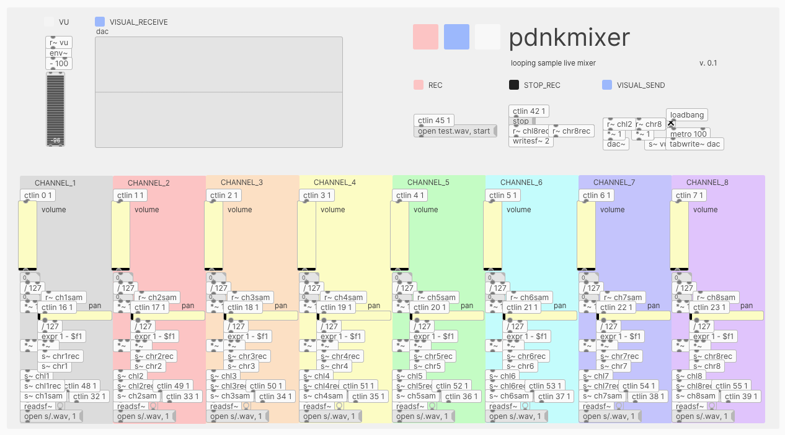

# pdnkmixer

Eight track looping sample mixer built in Pure Data. For standalone use or via MIDI with Korg nanokontrol2.

## Usage

pdnkmixer is a patch for [Pure Data](https://puredata.info/downloads).

### Loading samples

Place sample files (44.1 kHz, 16-bit stereo WAV) in a folder titled `s`.

Load samples by typing the sample titles in the bottom message box for each channel: `open s/SAMPLETITLE.wav, 1`.

Click the message box or the bang above it in order to start looping the sample.

### Volume and panning

Use the two sliders on each channel to adjust volume and panning.

### Recording

Click `open test.wav, start` under *REC* to begin recording.

Click `stop` under *STOP_REC* to stop recording.

### Use w/ nanokontrol2

Connect your nanokontrol2 (or another USB MIDI control surface) to the computer. Click Media >> MIDI settings... and choose nanokontrol2 as the Input Device.
